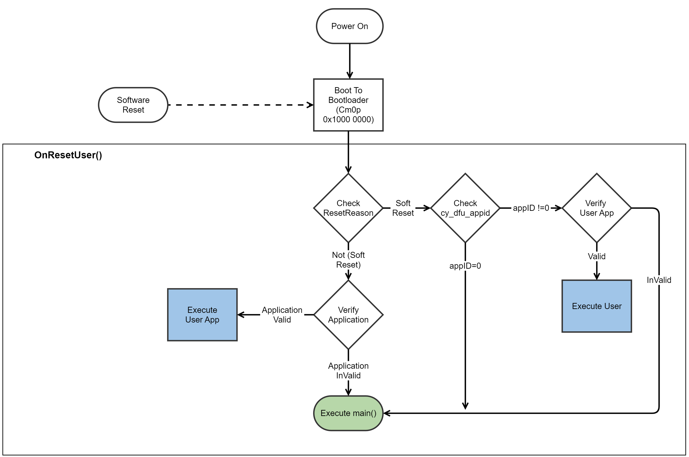
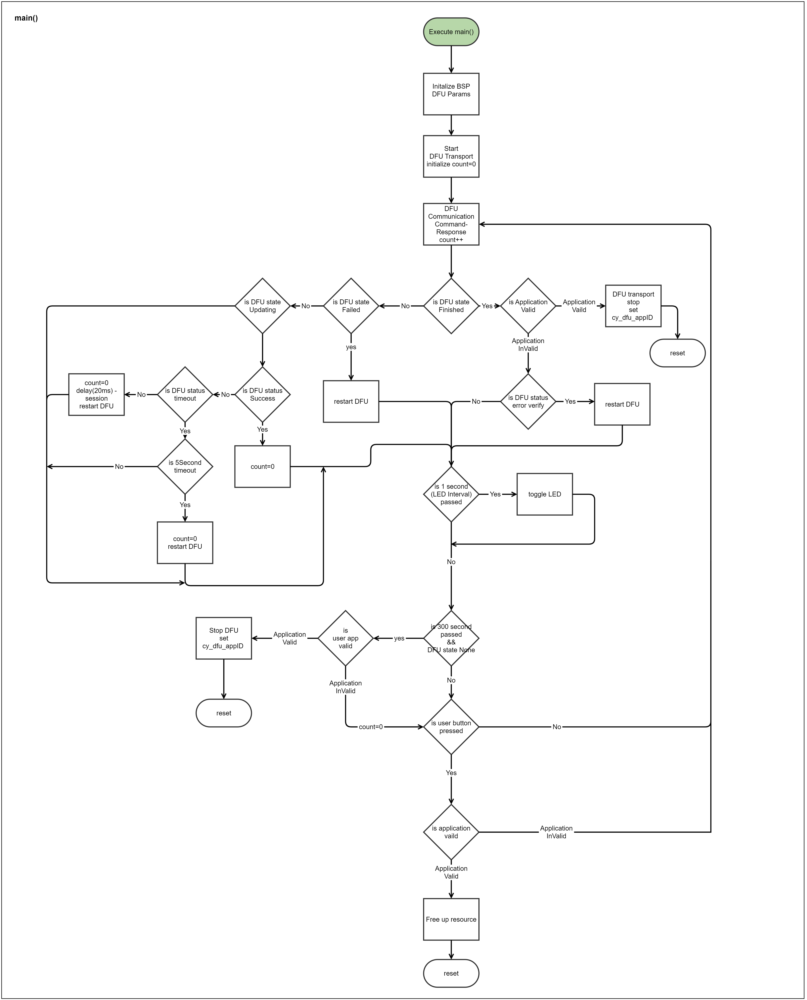

# PSoC&trade; 6 MCU: Basic Device Firmware Upgrade (DFU)

This example demonstrates the basic DFU with PSoC&trade; 6 MCU. This includes downloading an application from a host and installing it in the device flash, and then transferring control to that application. This example bundles two applications:

**Bootloader app:** Implements a [DFU middleware library](https://github.com/Infineon/dfu)-based basic bootloader application run by the CM0P CPU. The bootloader handles the image download, verification, and upgrades. When the image is valid, the bootloader lets the CM4 CPU boot the application.

**Blinky app:** This is a tiny application run by the CM4 CPU that blinks an LED at a 5 Hz rate continuously. This application transfers control to the bootloader when the user button is pressed.

> **Note:** This example supports only *I2C*, *UART*, *SPI*, and *EMUSB_CDC* for DFU transport currently.

[View this README on GitHub.](https://github.com/Infineon/mtb-example-psoc6-dfu-basic)

[Provide feedback on this code example.](https://cypress.co1.qualtrics.com/jfe/form/SV_1NTns53sK2yiljn?Q_EED=eyJVbmlxdWUgRG9jIElkIjoiQ0UyMzI1MDQiLCJTcGVjIE51bWJlciI6IjAwMi0zMjUwNCIsIkRvYyBUaXRsZSI6IlBTb0MmdHJhZGU7IDYgTUNVOiBCYXNpYyBEZXZpY2UgRmlybXdhcmUgVXBncmFkZSAoREZVKSIsInJpZCI6InJ4aHYiLCJEb2MgdmVyc2lvbiI6IjMuMS4wIiwiRG9jIExhbmd1YWdlIjoiRW5nbGlzaCIsIkRvYyBEaXZpc2lvbiI6Ik1DRCIsIkRvYyBCVSI6IklDVyIsIkRvYyBGYW1pbHkiOiJQU09DIn0=)

## Requirements

- [ModusToolbox&trade;](https://www.infineon.com/modustoolbox) v3.1 or later (tested with v3.1)
- Board support package (BSP) minimum required version: 4.2.0
- Programming language: C
- Associated parts: All [PSoC&trade; 6 MCU](https://www.infineon.com/cms/en/product/microcontroller/32-bit-psoc-arm-cortex-microcontroller/psoc-6-32-bit-arm-cortex-m4-mcu) parts

## Supported toolchains (make variable 'TOOLCHAIN')

- GNU Arm&reg; Embedded Compiler v11.3.1 (`GCC_ARM`) – Default value of `TOOLCHAIN`
- Arm&reg; Compiler v6.16 (`ARM`)
- IAR C/C++ Compiler v9.30.1 (`IAR`)


## Supported kits (make variable 'TARGET')

- [PSoC&trade; 62S2 Wi-Fi Bluetooth&reg; Prototyping Kit](https://www.infineon.com/CY8CPROTO-062S2-43439) (`CY8CPROTO-062S2-43439`) – Default value of `TARGET`
- [PSoC&trade; 6 Wi-Fi Bluetooth&reg; Prototyping Kit](https://www.infineon.com/CY8CPROTO-062-4343W) (`CY8CPROTO-062-4343W`)
- [PSoC&trade; 6 Bluetooth&reg; LE Pioneer Kit](https://www.infineon.com/CY8CKIT-062-BLE) (`CY8CKIT-062-BLE`) 
- [PSoC&trade; 6 Wi-Fi Bluetooth&reg; Pioneer Kit](https://www.infineon.com/CY8CKIT-062-WIFI-BT) (`CY8CKIT-062-WIFI-BT`)
- [PSoC&trade; 6 Bluetooth&reg; LE Prototyping Kit](https://www.infineon.com/CY8CPROTO-063-BLE) (`CY8CPROTO-063-BLE`)
- [PSoC&trade; 62S2 Wi-Fi Bluetooth&reg; Pioneer Kit](https://www.infineon.com/CY8CKIT-062S2-43012) (`CY8CKIT-062S2-43012`)
- [PSoC&trade; 62S1 Wi-Fi Bluetooth&reg; Pioneer Kit](https://www.infineon.com/CYW9P62S1-43438EVB-01) (`CYW9P62S1-43438EVB-01`)
- [PSoC&trade; 62S1 Wi-Fi Bluetooth&reg; Pioneer Kit](https://www.infineon.com/CYW9P62S1-43012EVB-01) (`CYW9P62S1-43012EVB-01`)
- [PSoC&trade; 62S3 Wi-Fi Bluetooth&reg; Prototyping Kit](https://www.infineon.com/CY8CPROTO-062S3-4343W) (`CY8CPROTO-062S3-4343W`)
- [PSoC&trade; 62S4 Pioneer Kit](https://www.infineon.com/CY8CKIT-062S4) (`CY8CKIT-062S4`)
- [PSoC&trade; 62S2 Evaluation Kit](https://www.infineon.com/CY8CEVAL-062S2) (`CY8CEVAL-062S2`, `CY8CEVAL-062S2-LAI-4373M2`, `CY8CEVAL-062S2-LAI-43439M2`, `CY8CEVAL-062S2-MUR-43439M2`, `CY8CEVAL-062S2-MUR-4373M2`, `CY8CEVAL-062S2-MUR-4373EM2`)

## Supported transports (make variable 'TRANSPORT_OPT')

The default transport is I2C. See the [Operation](#operation) section for instructions to change  `TRANSPORT_OPT`.

 TARGET                    | UART | I2C | EMUSB_CDC |  SPI
 :------------------------ | :--- | :---| :------ | :-----
 CY8CKIT-062-BLE           | Yes  | Yes | No      | Yes
 CY8CPROTO-062-4343W       | Yes  | Yes | Yes     | No
 CY8CPROTO-062S2-43439     | Yes  | Yes | Yes     | No
 CY8CKIT-062-WIFI-BT       | Yes  | Yes | Yes     | Yes
 CY8CPROTO-063-BLE         | Yes  | Yes | No      | No
 CY8CKIT-062S2-43012       | Yes  | Yes | Yes     | No
 CYW9P62S1-43438EVB-01     | Yes  | Yes | Yes     | No
 CYW9P62S1-43012EVB-01     | Yes  | Yes | Yes     | No
 CY8CPROTO-062S3-4343W     | Yes  | Yes | Yes     | No
 CY8CKIT-062S4             | Yes  | Yes | Yes     | No
 CY8CEVAL-062S2            | Yes  | Yes | Yes     | No
 CY8CEVAL-062S2-LAI-4373M2 | Yes  | Yes | Yes     | No
 CY8CEVAL-062S2-LAI-43439M2| Yes  | Yes | Yes     | No
 CY8CEVAL-062S2-MUR-43439M2| Yes  | Yes | Yes     | No
 CY8CEVAL-062S2-MUR-4373M2 | Yes  | Yes | Yes     | No
 CY8CEVAL-062S2-MUR-4373EM2| Yes  | Yes | Yes     | No

## Hardware setup

This example uses the board's default configuration. See the kit user guide to ensure that the board is configured correctly.

> **Note:** The PSoC&trade; 6 Bluetooth&reg; LE Pioneer Kit (CY8CKIT-062-BLE) and the PSoC&trade; 6 Wi-Fi Bluetooth&reg; Pioneer Kit (CY8CKIT-062-WIFI-BT) ship with KitProg2 installed. ModusToolbox&trade; requires KitProg3. Before using this code example, make sure that the board is upgraded to KitProg3. The tool and instructions are available in the [Firmware Loader](https://github.com/Infineon/Firmware-loader) GitHub repository. If you do not upgrade, you will see an error like "unable to find CMSIS-DAP device" or "KitProg firmware is out of date".


## Software setup

This example requires no additional software or tools.


## Using the code example

### Create the project

The ModusToolbox&trade; tools package provides the Project Creator as both a GUI tool and a command line tool.

<details><summary><b>Use Project Creator GUI</b></summary>

1. Open the Project Creator GUI tool.

   There are several ways to do this, including launching it from the dashboard or from inside the Eclipse IDE. For more details, see the [Project Creator user guide](https://www.infineon.com/ModusToolboxProjectCreator) (locally available at *{ModusToolbox&trade; install directory}/tools_{version}/project-creator/docs/project-creator.pdf*).

2. On the **Choose Board Support Package (BSP)** page, select a kit supported by this code example. See [Supported kits](#supported-kits-make-variable-target).

   > **Note:** To use this code example for a kit not listed here, you may need to update the source files. If the kit does not have the required resources, the application may not work.

3. On the **Select Application** page:

   a. Select the **Applications(s) Root Path** and the **Target IDE**.

   > **Note:** Depending on how you open the Project Creator tool, these fields may be pre-selected for you.

   b.	Select this code example from the list by enabling its check box.

   > **Note:** You can narrow the list of displayed examples by typing in the filter box.

   c. (Optional) Change the suggested **New Application Name** and **New BSP Name**.

   d. Click **Create** to complete the application creation process.

</details>

<details><summary><b>Use Project Creator CLI</b></summary>

The 'project-creator-cli' tool can be used to create applications from a CLI terminal or from within batch files or shell scripts. This tool is available in the *{ModusToolbox&trade; install directory}/tools_{version}/project-creator/* directory.

Use a CLI terminal to invoke the 'project-creator-cli' tool. On Windows, use the command-line 'modus-shell' program provided in the ModusToolbox&trade; installation instead of a standard Windows command-line application. This shell provides access to all ModusToolbox&trade; tools. You can access it by typing "modus-shell" in the search box in the Windows menu. In Linux and macOS, you can use any terminal application.

The following example clones the "[Basic DFU](https://github.com/Infineon/mtb-example-psoc6-dfu-basic)" application with the desired name "BasicDFU" configured for the *CY8CPROTO-062S2-43439* BSP into the specified working directory, *C:/mtb_projects*:

   ```
   project-creator-cli --board-id CY8CPROTO-062S2-43439 --app-id mtb-example-psoc6-dfu-basic --user-app-name BasicDFU --target-dir "C:/mtb_projects"
   ```

<mark>Update the above paragraph and commands to match your CE.

The 'project-creator-cli' tool has the following arguments:

Argument | Description | Required/optional
---------|-------------|-----------
`--board-id` | Defined in the <id> field of the [BSP](https://github.com/Infineon?q=bsp-manifest&type=&language=&sort=) manifest | Required
`--app-id`   | Defined in the <id> field of the [CE](https://github.com/Infineon?q=ce-manifest&type=&language=&sort=) manifest | Required
`--target-dir`| Specify the directory in which the application is to be created if you prefer not to use the default current working directory | Optional
`--user-app-name`| Specify the name of the application if you prefer to have a name other than the example's default name | Optional

> **Note:** The project-creator-cli tool uses the `git clone` and `make getlibs` commands to fetch the repository and import the required libraries. For details, see the "Project creator tools" section of the [ModusToolbox&trade; tools package user guide](https://www.infineon.com/ModusToolboxUserGuide) (locally available at {ModusToolbox&trade; install directory}/docs_{version}/mtb_user_guide.pdf).

</details>


### Open the project

After the project has been created, you can open it in your preferred development environment.


<details><summary><b>Eclipse IDE</b></summary>

If you opened the Project Creator tool from the included Eclipse IDE, the project will open in Eclipse automatically.

For more details, see the [Eclipse IDE for ModusToolbox&trade; user guide](https://www.infineon.com/MTBEclipseIDEUserGuide) (locally available at *{ModusToolbox&trade; install directory}/docs_{version}/mt_ide_user_guide.pdf*).

</details>


<details><summary><b>Visual Studio (VS) Code</b></summary>

Launch VS Code manually, and then open the generated *{project-name}.code-workspace* file located in the project directory.

For more details, see the [Visual Studio Code for ModusToolbox&trade; user guide](https://www.infineon.com/MTBVSCodeUserGuide) (locally available at *{ModusToolbox&trade; install directory}/docs_{version}/mt_vscode_user_guide.pdf*).

</details>


<details><summary><b>Keil µVision</b></summary>

Double-click the generated *{project-name}.cprj* file to launch the Keil µVision IDE.

For more details, see the [Keil µVision for ModusToolbox&trade; user guide](https://www.infineon.com/MTBuVisionUserGuide) (locally available at *{ModusToolbox&trade; install directory}/docs_{version}/mt_uvision_user_guide.pdf*).

</details>


<details><summary><b>IAR Embedded Workbench</b></summary>

Open IAR Embedded Workbench manually, and create a new project. Then select the generated *{project-name}.ipcf* file located in the project directory.

For more details, see the [IAR Embedded Workbench for ModusToolbox&trade; user guide](https://www.infineon.com/MTBIARUserGuide) (locally available at *{ModusToolbox&trade; install directory}/docs_{version}/mt_iar_user_guide.pdf*).

</details>


<details><summary><b>Command line</b></summary>

If you prefer to use the CLI, open the appropriate terminal, and navigate to the project directory. On Windows, use the command-line 'modus-shell' program; on Linux and macOS, you can use any terminal application. From there, you can run various `make` commands.

For more details, see the [ModusToolbox&trade; tools package user guide](https://www.infineon.com/ModusToolboxUserGuide) (locally available at *{ModusToolbox&trade; install directory}/docs_{version}/mtb_user_guide.pdf*).

</details>

## Operation

1. Connect the board to your PC using the provided USB cable through the KitProg3 USB connector.

2. Build and program the bootloader for the board using one of the following:

    >**Note:** *I2C* is configured as the default DFU transport. To change the DFU transport, edit the Makefile to set `TRANSPORT_OPT?=<transport>`.

   <details><summary><b>Using Eclipse IDE for ModusToolbox&trade; software</b></summary>

    1. Select the bootloader project in the Project Explorer.

    2. In the **Quick Panel**, scroll down, and click **\<Application Name> Program (KitProg3_MiniProg4)**.
      </details>

   <details><summary><b>Using CLI</b></summary>

   From the terminal, execute the `make -C bootloader_cm0p program_proj` command to build and program the application using the default toolchain to the default target with a default DFU transport. You can specify a target, toolchain and transport manually:
      ```
      make -C bootloader_cm0p program_proj TARGET=<BSP> TOOLCHAIN=<toolchain> TRANSPORT_OPT=<transport>
      ```

      Example:
      ```
      make -C bootloader_cm0p program_proj TARGET=CY8CKIT-062-BLE TOOLCHAIN=GCC_ARM TRANSPORT_OPT=UART
      ```
   </details>

3. After programming, press the *RESET* button on the board. The bootloader starts automatically and the LED starts blinking. Confirm that the kit LED blinks at approximately 1 Hz.

4. Generate an upgradable application image using one of the following. On a successful build, a *\<APPNAME>.cyacd2* file is generated.

   <details><summary><b>Using Eclipse IDE for ModusToolbox&trade; software</b></summary>

      1. Select the blinky project in the Project Explorer.

      2. In the **Quick Panel**, scroll down, and click **\<Application Name> Build (KitProg3_MiniProg4)**.
   </details>

   <details><summary><b>Using CLI</b></summary>

     From the terminal, execute the `make build` command to build the application using the default toolchain to the default target. You can specify a target and toolchain manually:
      ```
      make -C blinky_cm4 build_proj TARGET=<BSP> TOOLCHAIN=<toolchain>
      ```

      Example:
      ```
      make -C blinky_cm4 build_proj TARGET=CY8CKIT-062-BLE TOOLCHAIN=GCC_ARM
      ```
   > **Note:** The application is DFU-transport-agnostic.

   </details>

5. Perform the Device Firmware Upgrade using the DFU host tool:

   1. Open the [DFU host tool](https://www.infineon.com/dgdl/Infineon-ModusToolbox_DFU_Host_Tool_1.60_User_Guide-UserManual-v01_00-EN.pdf?fileId=8ac78c8c8386267f0183a95733d6596e). Connect to the device using the transport configured.

   2. Select *blinky_cm4_crc.cyacd2*. By default, it is generated in the *mtb-example-psoc6-dfu-basic/<blinky_cm4>/build/< BSP >/< config >/<target-directory>* directory on a successful build.

   3. Select an appropriate port based on the transport (`TRANSPORT_OPT`) configured in the bootloader. **I2C** is the default transport configuration. Select **400 kHz** speed, set the address to **12**, and then click **Program**.

   4. Observe the image download progress status on the progress bar, and wait for the download to complete.

      > **Note:** See [DFU host tool](https://www.infineon.com/dgdl/Infineon-ModusToolbox_DFU_Host_Tool_1.60_User_Guide-UserManual-v01_00-EN.pdf?fileId=8ac78c8c8386267f0183a95733d6596e) documentation for further details on selecting a port and configuring it for communication-based on the transport enabled in the bootloader.

**Figure 1. Downloading the application using the DFU host tool**


After a successful download, the device will boot to *blinky_cm4*. Observe the user LED blinking at 5 Hz.


### Switching between bootloader and application

Dynamic switching between the bootloader and the application is enabled with the user button events. Press the user button to switch to the bootloader while the application is running, LED interval changes between 5 Hz to 1 Hz and vice versa. Note that a switching request will be honored by the bootloader only if there is a valid application in the memory.

> **Note:** Build the App0 and App1 projects with the same toolchain. Application transfer may fail otherwise. Check the **Build Settings** for each project.


## Debugging


You can debug the example to step through the code.


<details><summary><b>In Eclipse IDE</b></summary>

Use the **\<Application Name> Debug (KitProg3_MiniProg4)** configuration in the **Quick Panel**. For details, see the "Program and debug" section in the [Eclipse IDE for ModusToolbox&trade; user guide](https://www.infineon.com/MTBEclipseIDEUserGuide).


> **Note:** **(Only while debugging)** On the CM4 CPU, some code in `main()` may execute before the debugger halts at the beginning of `main()`. This means that some code executes twice – once before the debugger stops execution, and again after the debugger resets the program counter to the beginning of `main()`. See [KBA231071](https://community.infineon.com/docs/DOC-21143) to learn about this and for the workaround.
</details>
<details><summary><b>In other IDEs</b></summary>

Follow the instructions in your preferred IDE.
</details>

## Design and implementation

### Overview

This example demonstrates the basic DFU operations based on the [DFU middleware library](https://github.com/Infineon/dfu). **Figure 2** shows the execution flow of the bootloader app.

**Figure 2. Bootloader app flow (CM0+)**






### Bootloader implementation

This bootloader sample implements an immutable bootloader with support for upgrading the application.

The [DFU host tool](https://www.infineon.com/dgdl/Infineon-ModusToolbox_DFU_Host_Tool_1.60_User_Guide-UserManual-v01_00-EN.pdf?fileId=8ac78c8c8386267f0183a95733d6596e) (typically running on the host PC) sends the application (*\<APPNAME>.cyacd2*) to the device. The bootloader receives the application image in chunks and overwrites the existing application image, see **Figure 3**. If a DFU session is interrupted, the application firmware will not be in a usable state. However, the device can still run the bootloader and perform the necessary actions to download and install the application in the subsequent DFU sessions.

**Figure 3. DFU design overview**


### DFU interfaces

The bootloader supports *I2C*, *UART*, *SPI*, and *USB_CDC* interfaces for communicating with the DFU host. The *templates/config* directory includes all the necessary configurations to select the supported interfaces. See  **Table 1** for the default configuration details. These default configurations can be changed according to the use case. However, you must ensure that the configuration of the DFU host tool matches the bootloader.

**Table 1. DFU transport configurations**
    
  DFU transport: I2C| Default |Description
   :--------------- | :------ | :-----
   Mode             | Slave   | Device acts as a slave
   Address          | 12      | 7-bit slave device address
   Data rate        |400 kbps | DFU supports standard data rates from 50 kbps to 1 Mbps

   <br>

   DFU transport: UART| Default |Description
   :----------------- | :------- | :-----
   Mode               | Standard | Standard, SmartCard, and IrDA are supported UART modes in SCB
   Baud rate(bps)     |115200    | Supports standard baud rates from 19200 to 115200
   Data width         | 8 bits   | Standard frame
   Parity             | None     | Standard frame
   Stop bits          | 1 bit    | Standard frame
   Bit order          | LSB first| Standard frame

   <br>

   DFU transport: USB_CDC     | Default |Description
   :--------------------------| :--------- | :-----
   Endpoints mask             | 255        | -
   Endpoint 1 transfer type   | Interrupt  | To initiate the transport
   Endpoint 2 transfer type   | Bulk       | To download and verify the binary image
   Endpoints buffer management| Manual CPU | USB supports communication using auto/manual DMA
   Endpoints access type      | 8-bit      | -

   <br>

   DFU transport: SPI | Default  |Description
   :------------------| :------  | :-----
   Mode               | Slave    | Device acts as a slave
   Shift direction    | MSB first| default direction set as MSB first  
   Clock speed        | 1 MHz    | DFU supports 1 MHz SPI Clock speed
   Mode               | Mode 00  | default mode set as Mode 00

   <br>

### Memory layout

The CM0P is used for the bootloader. The 64 KB is reserved for the bootloader followed by a 128 KB reserved region for future enhancements. Another 64 KB is allocated to the application firmware followed by the reserved region. The size of this empty/reserved region depends on the size of the flash available on the selected target device. See respective device datasheets for details. The last 1 KB region of the flash is reserved for bootloader metadata.

To change the memory layout or usage, update the respective target linker script files. The linker scripts can also be modified to define dedicated regions of the memory for each application.

The RAM is shared by the bootloader and the blinky applications, with a common area used by both projects. The RAM regions must be aligned to a 1 KB boundary because they contain the interrupt vector table remapped at the start.

**Figure 4. DFU memory map**


### Software reset

When transferring the control from one application to another, the recommended method is through a device software reset. This enables each application to initialize device hardware blocks and signal routing from a known state. It is possible to freeze the state of I/O pins so that they are maintained through a software reset. Defined portions of the SRAM are also maintained through a software reset. For more information, see the device-specific technical reference manual (TRM).


### Running the code example on a Dual-CPU device

This code example is designed to run the bootloader on CM0+ CPU and applications on the CM4 CPU. The bootloader on CM0+ will always check for valid application binary On every power cycle to transfer control to the CM4 CPU to execute the application.


### Resources and settings

**Table 2. Bootloader resources**

 Resource  |  Alias/object     |    Purpose
 :------- | :------------    | :------------
 SCB (I2C) (PDL) | DFU_I2C          | I2C slave driver to communicate with the DFU host
 SCB (UART)(PDL) | DFU_UART          | UART driver to communicate with the DFU host
 SCB (SPI) (PDL) | DFU_SPI          | SPI slave driver to communicate with the DFU host
 emUSB (MW) | DFU_EMUSB_CDC  | emUSB-Device driver to communicate with the DFU host
 GPIO (HAL)    | CYBSP_USER_LED         | User LED
 GPIO (HAL)    | CYBSP_USER_BTN         | User button

<br>

**Table 3. Application resources**

 Resource  |  Alias/object     |    Purpose
 :------- | :------------    | :------------
 GPIO (HAL)    | CYBSP_USER_LED         | User LED
 GPIO (HAL)    | CYBSP_USER_BTN         | User button

<br>

## Related resources


Resources  | Links
-----------|----------------------------------
Application notes  | [AN228571](https://www.infineon.com/AN228571) – Getting started with PSoC&trade; 6 MCU on ModusToolbox&trade; software <br>  [AN215656](https://www.infineon.com/AN215656) – PSoC&trade; 6 MCU: Dual-CPU system design
Code examples  | [Using ModusToolbox&trade;](https://github.com/Infineon/Code-Examples-for-ModusToolbox-Software) on GitHub
Device documentation | [PSoC&trade; 6 MCU datasheets](https://documentation.infineon.com/html/psoc6/bnm1651211483724.html) <br> [PSoC&trade; 6 technical reference manuals](https://documentation.infineon.com/html/psoc6/zrs1651212645947.html)
Development kits | Select your kits from the [Evaluation board finder](https://www.infineon.com/cms/en/design-support/finder-selection-tools/product-finder/evaluation-board)
Libraries on GitHub  | [mtb-pdl-cat1](https://github.com/Infineon/mtb-pdl-cat1) – PSoC&trade; 6 Peripheral Driver Library (PDL)  <br> [mtb-hal-cat1](https://github.com/Infineon/mtb-hal-cat1) – Hardware Abstraction Layer (HAL) library <br> [retarget-io](https://github.com/Infineon/retarget-io) – Utility library to retarget STDIO messages to a UART port
Middleware on GitHub  | [psoc6-middleware](https://github.com/Infineon/modustoolbox-software#psoc-6-middleware-libraries) – Links to all PSoC&trade; 6 MCU middleware <br> [dfu](https://github.com/Infineon/dfu) - Device Firmware Update (DFU) Middleware Library <br> [emUSB-Device](https://github.com/Infineon/emusb-device) - SEGGER emUSB-Device for ModusToolbox
Tools   | [ModusToolbox&trade;](https://www.infineon.com/modustoolbox) – ModusToolbox&trade; software is a collection of easy-to-use libraries and tools enabling rapid development with Infineon MCUs for applications ranging from wireless and cloud-connected systems to embedded sense and control using AIROC&trade; Wi-Fi and Bluetooth&reg; connectivity devices. ModusToolbox&trade; incorporates a comprehensive set of BSPs, HAL, libraries, configuration tools, and provides support for industry-standard IDEs to fast-track your embedded application development.

<br>

## Other resources

Infineon provides a wealth of data at www.infineon.com to help you select the right device, and quickly and effectively integrate it into your design.

For PSoC&trade; 6 MCU devices, see [How to design with PSoC&trade; 6 MCU - KBA223067](https://community.infineon.com/docs/DOC-14644) in the Infineon Developer community.

## Document history

Document title: *CE232504* – *PSoC&trade; 6 MCU: Basic Device Firmware Upgrade (DFU)*

 Version | Description of change
 ------- | ---------------------
 1.0.0   | New code example
 1.1.0   | Updated code example to support USB_CDC
 1.2.0   | Updated DFU_PATH in makefile
 1.3.0   | Added support for 256 KB CY8CKIT-062S4 kit
 1.4.0   | Added support for new kits
 2.0.0   | Updated to support ModusToolbox&trade; software v3.0 and BSPs v4.X <br> Updated the basic DFU code example to run Bootloader from CM0+ and application from CM4 core
 2.1.0   | Updated the basic DFU code example to run on Arm&reg; and IAR compilers <br> Added support for new kit CY8CEVAL-062S2-MUR-43439M2 <br> Updated code example to support SPI
 3.0.0   | Updated the code example to use dfu v5.1.0 library <br> Updated code example to emUSB-Device Middleware <br> Updated to support ModusToolbox&trade; software v3.1
 3.1.0   | Added support for new kits
<br>

All referenced product or service names and trademarks are the property of their respective owners.

The Bluetooth&reg; word mark and logos are registered trademarks owned by Bluetooth SIG, Inc., and any use of such marks by Infineon is under license.


---------------------------------------------------------

© Cypress Semiconductor Corporation, 2021-2024. This document is the property of Cypress Semiconductor Corporation, an Infineon Technologies company, and its affiliates ("Cypress").  This document, including any software or firmware included or referenced in this document ("Software"), is owned by Cypress under the intellectual property laws and treaties of the United States and other countries worldwide.  Cypress reserves all rights under such laws and treaties and does not, except as specifically stated in this paragraph, grant any license under its patents, copyrights, trademarks, or other intellectual property rights.  If the Software is not accompanied by a license agreement and you do not otherwise have a written agreement with Cypress governing the use of the Software, then Cypress hereby grants you a personal, non-exclusive, nontransferable license (without the right to sublicense) (1) under its copyright rights in the Software (a) for Software provided in source code form, to modify and reproduce the Software solely for use with Cypress hardware products, only internally within your organization, and (b) to distribute the Software in binary code form externally to end users (either directly or indirectly through resellers and distributors), solely for use on Cypress hardware product units, and (2) under those claims of Cypress's patents that are infringed by the Software (as provided by Cypress, unmodified) to make, use, distribute, and import the Software solely for use with Cypress hardware products.  Any other use, reproduction, modification, translation, or compilation of the Software is prohibited.
<br>
TO THE EXTENT PERMITTED BY APPLICABLE LAW, CYPRESS MAKES NO WARRANTY OF ANY KIND, EXPRESS OR IMPLIED, WITH REGARD TO THIS DOCUMENT OR ANY SOFTWARE OR ACCOMPANYING HARDWARE, INCLUDING, BUT NOT LIMITED TO, THE IMPLIED WARRANTIES OF MERCHANTABILITY AND FITNESS FOR A PARTICULAR PURPOSE.  No computing device can be absolutely secure.  Therefore, despite security measures implemented in Cypress hardware or software products, Cypress shall have no liability arising out of any security breach, such as unauthorized access to or use of a Cypress product. CYPRESS DOES NOT REPRESENT, WARRANT, OR GUARANTEE THAT CYPRESS PRODUCTS, OR SYSTEMS CREATED USING CYPRESS PRODUCTS, WILL BE FREE FROM CORRUPTION, ATTACK, VIRUSES, INTERFERENCE, HACKING, DATA LOSS OR THEFT, OR OTHER SECURITY INTRUSION (collectively, "Security Breach").  Cypress disclaims any liability relating to any Security Breach, and you shall and hereby do release Cypress from any claim, damage, or other liability arising from any Security Breach.  In addition, the products described in these materials may contain design defects or errors known as errata which may cause the product to deviate from published specifications. To the extent permitted by applicable law, Cypress reserves the right to make changes to this document without further notice. Cypress does not assume any liability arising out of the application or use of any product or circuit described in this document. Any information provided in this document, including any sample design information or programming code, is provided only for reference purposes.  It is the responsibility of the user of this document to properly design, program, and test the functionality and safety of any application made of this information and any resulting product.  "High-Risk Device" means any device or system whose failure could cause personal injury, death, or property damage.  Examples of High-Risk Devices are weapons, nuclear installations, surgical implants, and other medical devices.  "Critical Component" means any component of a High-Risk Device whose failure to perform can be reasonably expected to cause, directly or indirectly, the failure of the High-Risk Device, or to affect its safety or effectiveness.  Cypress is not liable, in whole or in part, and you shall and hereby do release Cypress from any claim, damage, or other liability arising from any use of a Cypress product as a Critical Component in a High-Risk Device. You shall indemnify and hold Cypress, including its affiliates, and its directors, officers, employees, agents, distributors, and assigns harmless from and against all claims, costs, damages, and expenses, arising out of any claim, including claims for product liability, personal injury or death, or property damage arising from any use of a Cypress product as a Critical Component in a High-Risk Device. Cypress products are not intended or authorized for use as a Critical Component in any High-Risk Device except to the limited extent that (i) Cypress's published data sheet for the product explicitly states Cypress has qualified the product for use in a specific High-Risk Device, or (ii) Cypress has given you advance written authorization to use the product as a Critical Component in the specific High-Risk Device and you have signed a separate indemnification agreement.
<br>
Cypress, the Cypress logo, and combinations thereof, ModusToolbox, PSoC, CAPSENSE, EZ-USB, F-RAM, and TRAVEO are trademarks or registered trademarks of Cypress or a subsidiary of Cypress in the United States or in other countries. For a more complete list of Cypress trademarks, visit www.infineon.com. Other names and brands may be claimed as property of their respective owners.
